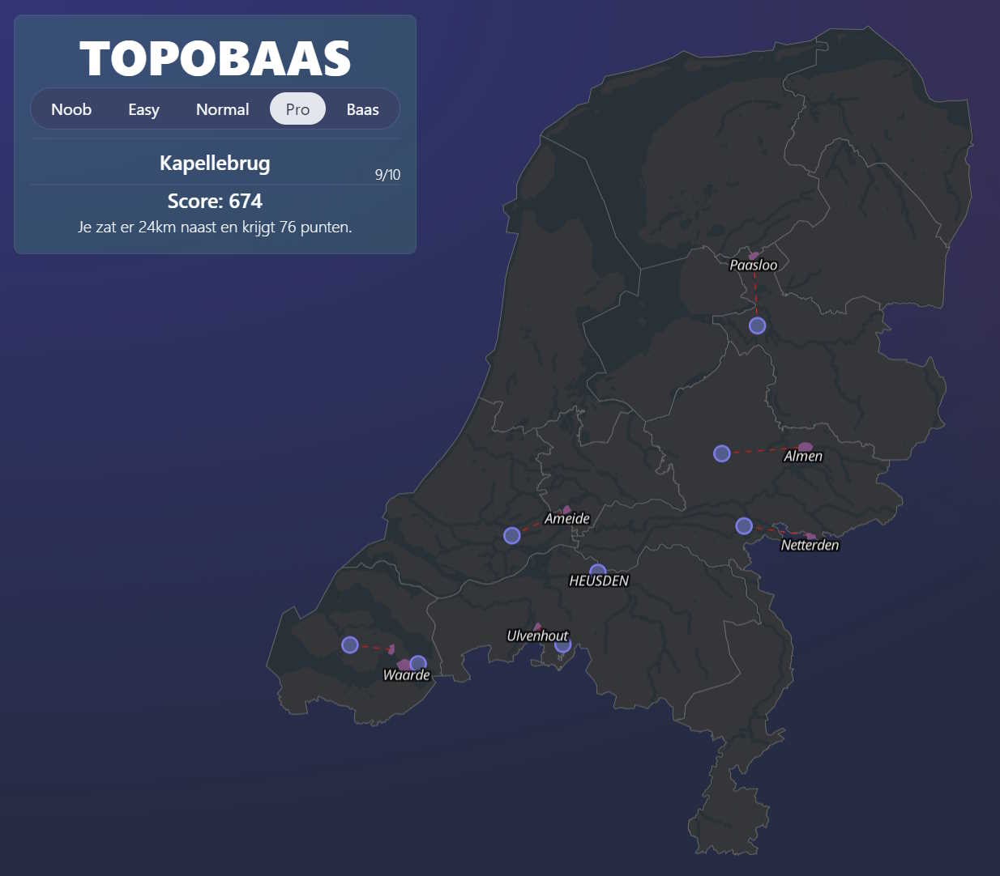

# topobaas

A quickly thrown together small Dutch topo game since woonplaatsgame seems to be offline.

visit [TOPOBAAS](https://tebben.github.io/topobaas) on github pages.



## Woonplaats data

We get places from the BAG and rank a place by the amount of BAG objects in a `woonplaats`, we can use the rank for the diffuculty level. The ranking is not perfect yet...

Query to create GeoJSON.

```sql
CREATE TABLE woonplaats_latest AS
WITH places AS (
	SELECT 
        t1.gid as id, 
        t1.woonplaatsnaam as name, 
        t1.woonplaatsstatus,
        t1.documentdatum,
        t1.documentnummer,
        t1.tijdstipregistratie,
        t1.geovlak as geom,
        (SELECT COUNT(*) FROM bagactueel.pand WHERE ST_Contains(t1.geovlak, pand.geovlak)) AS object_count
    FROM 
        bagactueel.woonplaats t1
    LEFT JOIN 
        bagactueel.woonplaats t2
    ON 
        t1.woonplaatsnaam = t2.woonplaatsnaam AND t1.tijdstipregistratie < t2.tijdstipregistratie
    WHERE 
        t2.woonplaatsnaam IS NULL
)
SELECT 
    id,
    name,
    woonplaatsstatus,
    documentdatum,
    documentnummer,
    tijdstipregistratie,
    geom,
    object_count
FROM places;


SELECT 
    jsonb_build_object(
        'type', 'FeatureCollection',
        'features', jsonb_agg(
            jsonb_build_object(
                'type', 'Feature',
                'properties', jsonb_build_object(
                    'id', a.id,
                    'name',	a.name,
                    'rank', a.rank
                ),
                'geometry', a.geom
            )
        )
    ) AS geojson
FROM (
	SELECT 
	    id,
	    name,
	    geom,
	    NTILE(20) OVER(ORDER BY object_count) AS rank
	FROM (
	    SELECT 
	        id,
	        name,
	        ST_AsGeoJSON(ST_Transform(ST_SimplifyPreserveTopology(geom, 400), 4326), 5)::json as geom,
	        object_count,
	        ROW_NUMBER() OVER (PARTITION BY name ORDER BY id DESC) as rn
	    FROM woonplaats_latest
	) sub
	WHERE rn = 1
) as a;

```